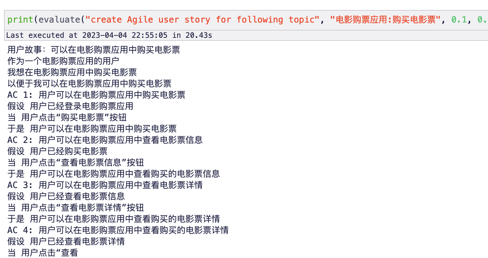

# Unit Minions

# 基于 Meta 的 Llama 训练 LoRA

训练步骤见：

- 方式 1：直接使用：[alpaca-lora.ipynb](alpaca-lora.ipynb) 
- 方式 2：直接使用 OpenBayes 容器：https://openbayes.com/console/phodal/containers/JBx5YD7HTdS

PS：训练烧钱……（调用 OpenAI 生成数据、云 GPU），如果你觉得帮到你，可以通过以下方式，帮助我们继续往前。

<table>
  <tr>
    <td></td>
    <td></td>
  </tr>
</table>

所以……，没钱的……

训练机器：OpenBayes（用我的专用邀请链接，注册 OpenBayes，双方各获得 60 分钟 RTX 3090 使用时长，支持累积，永久有效：
https://openbayes.com/console/signup?r=phodal_uVxU) A100 大概 1 小时，使用 A0390 大概 3 小时。

## 基本知识

相关背景

1. 基础模型：Meta 开源 LLaMA 系列模型
2. Instruct-Tune：[https://github.com/tloen/alpaca-lora](https://github.com/tloen/alpaca-lora)

由于，我们的目标不是对模型调优，生成通用的模型。而是训练特定用途的 Lora，所以，我们没有加入：[Stanford Alpaca](https://github.com/tatsu-lab/stanford_alpaca) 中的数据。因此，时间更短，如 8000+ 测试代码只需要 1 小时，3400+ 的用户故事只需要 25 分钟。

## 训练 1：根据业务代码生成测试代码

代码生成测试用例的 Lora 见：[https://github.com/unit-mesh/unit-minions/releases/tag/v0.0.1](https://github.com/unit-mesh/unit-minions/releases/tag/v0.0.1)


基本思路：

- 在时间有限的情况下，基于 OpenAI 的数据来完善。但是，OpenAI 编写的测试用例不一定靠谱，所以让他生成业务代码。
- 在时间充裕的情况下，可以分析 AST 来合并第一和第二步，也是比较合理的方案，毕竟 OpenAI 的 API 很贵。

### 步骤 1. 准备数据

1. 下载 GitHub 上的项目（需要包含测试用例）
2. 建立每个项目的 `src/main` 下的 Java 文件 map，如果同时存在对应的测试文件，则拉入的数据集中。
3. 并生成每个测试对应的类的基本信息（以减少 OpenAI Token 使用）：
```
org.unitmesh.processor.TestClass(String, Int)
- fields: field1:String, field2:Int
- methods: method1(String, Int): String, method2(): Int
```
4. 按测试用例（即 @Test 方法）拆分每个测试文件，拆成 N 个（即 test1、test2 是两个不同的数据）
```java
class TestProcessorTest {
    @Test
    void test1() {
    }
    
    @Test
    void test2() {
    }
}
```

最后，生成的数据如下：

{"classInfo": "com.thoughtworks.go.security.AESEncrypter(AESCipherProvider)\n- fields: ENCODER:Base64.Encoder, DECODER:Base64.Decoder, cipherProvider:AESCipherProvider, ivProvider:IVProvider\n- methods: createIVProviderInstance(): IVProvider, canDecrypt(String): boolean, encrypt(String): String, decrypt(String): String, createSecretKeySpec(): SecretKeySpec", "testMethod": "public class AESEncrypterTest {\n\n    private AESEncrypter aesEncrypter;\n\n    @Test\n    public void shouldGenerateEncryptedText() throws CryptoException {\n        String encrypt = aesEncrypter.encrypt(\"p@ssw0rd\");\n        assertThat(encrypt).startsWith(\"AES\");\n        assertThat(encrypt.split(\":\")).hasSize(3);\n    }\n}\n", "id": "task_0"}

### 步骤 2. 使用 OpenAI Davinci 编写实现代码（代码见：[test-to-code.py](test-to-code.py)）


1. 将上面的数据转换为 JSONL，合并成 prompt。
2. 让 Davinci 完成填空题。

最后生成的 prompt 示例如下：

```markdown
You are a programmer and implementation a method with TDD. Here are the requirements:

1. According follows class information and tests code to write a method.
2. Try you best to thinking corner case.
3. You only return the code, no explain.

class information: 

### 
io.github.robwin.swagger.test.AbstractContractValidator()
- methods: findExpectedPaths(Swagger, SwaggerAssertionConfig): Map<String,Path>, getPathsIncludingBasePath(Swagger): Map<String,Path>, getPathsWithPrefix(Swagger, String): Map<String,Path>, isBlankOrSlash(String): boolean
###

test code: 

### 
/**
 * Tests AbstractContractValidator.
 */
@RunWith(Enclosed.class)
public class AbstractContractValidatorTest {

    /**
     * Tests getPathsIncludingBasePath().
     */
    public static class GetPathsIncludingBasePath {

        @Test
        public void shouldReturnPathsPrefixedIfBasePathSet() {
            // given
            Swagger swagger = buildSwaggerFrom("/swagger.json");
            // when
            Map<String, Path> paths = new DummyValidator().getPathsIncludingBasePath(swagger);
            // then
            paths.entrySet().forEach(e -> assertThat(e.getKey(), startsWith(swagger.getBasePath())));
        }
    }

    /**
     * Tests findExpectedPaths().
     */
    public static class FindExpectedPaths {
    }

    private static class DummyValidator extends AbstractContractValidator {
    }
}
###

```

### 步骤 3. 训练

训练步骤可以直接使用： [alpaca-lora.ipynb](alpaca-lora.ipynb)

## 训练 2：拆分用户故事

训练步骤可以直接使用： [alpaca-lora.ipynb](alpaca-lora.ipynb) 或者直接使用 OpenBayes 容器：https://openbayes.com/console/phodal/containers/JBx5YD7HTdS

代码生成测试用例的 Lora 见：[https://github.com/unit-mesh/unit-minions/releases/tag/v0.0.2](https://github.com/unit-mesh/unit-minions/releases/tag/v0.0.2)

结果：




基本思路：

1. 结合常见的领域（如在线网站），借用 OpenAI 生成用户任务（如登录、浏览列表等等）
2. 根据用户故事生成用户故事。
3. 训练 Alpaca LoRA。

如下所示：


### 步骤 1. 准备数据

1. 调用 OpenAI 按分类创建用户任务。prompt 如下：

```markdown
Design a User Story Mapping for ${domain} application based on your understanding. Here are the requirements: 

1. Your user story map should include only user tasks to demonstrate how users will interact with the application.
2. Our user story map should be based on your understanding of the ${domain} application and its users, and should be designed to address their needs and pain points.
3. You may use any tools or formats you choose to create your user story map, but it should be easily shareable and understandable by stakeholders.
4. Your expression should be more concise and clear.
5. Your return should be like as follows:

###
User Tasks:
1. ...
###
```

2. 调用 OpenAI 根据用户任务创建用户故事。prompt 如下：

```markdown
为下面的需求编写用户故事：${domain} 应用的 ${story_name} 功能。 要求如下：

1. 必须要考虑尽可能考虑各种异常场景，添加更多的 AC。
2. 你的返回模板如下所示：

###
用户故事：可以选择宝贝出行服务
作为 莉莉妈
我想 在滴滴打车的手机客户端里选择宝贝出行服务
以便于 我能够带宝宝打车出行的时候打到有儿童座椅的车

AC 1:  莉莉妈可以选择宝贝出行服务
假设 xxx
当 xxx
于是 xxx
###
```

### 步骤 2. 训练

训练步骤可以直接使用： [alpaca-lora.ipynb](alpaca-lora.ipynb)

