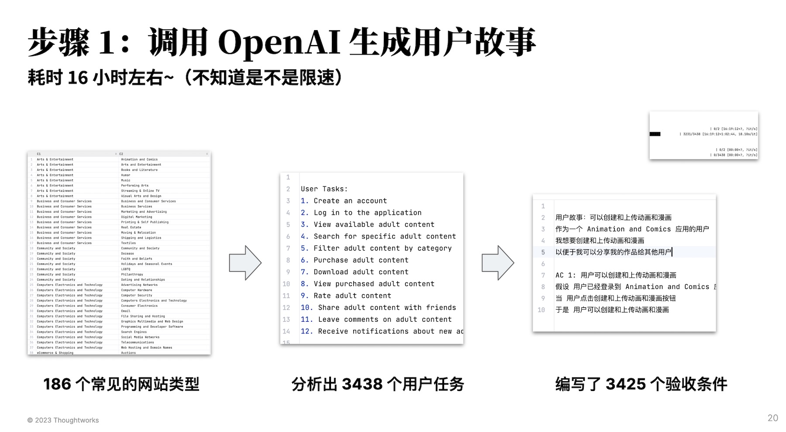
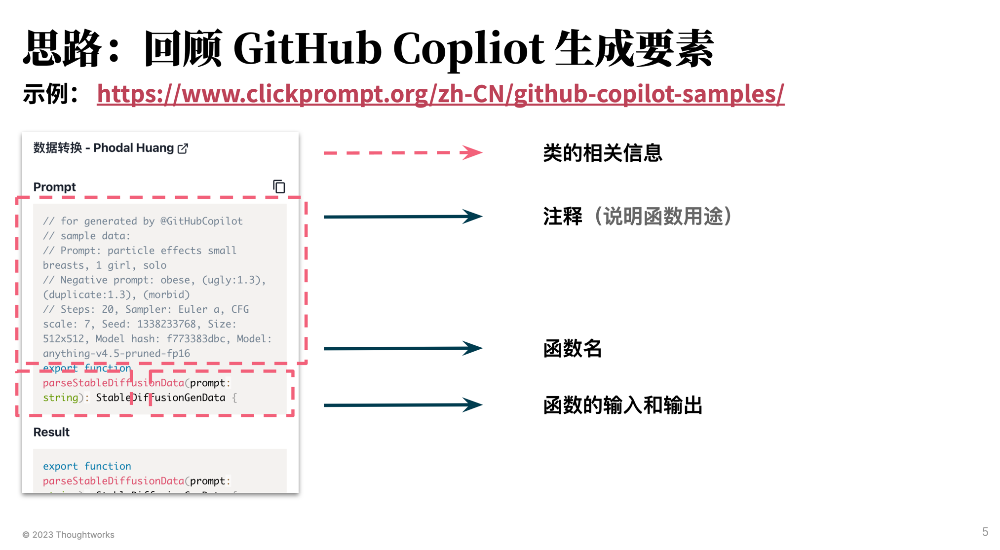
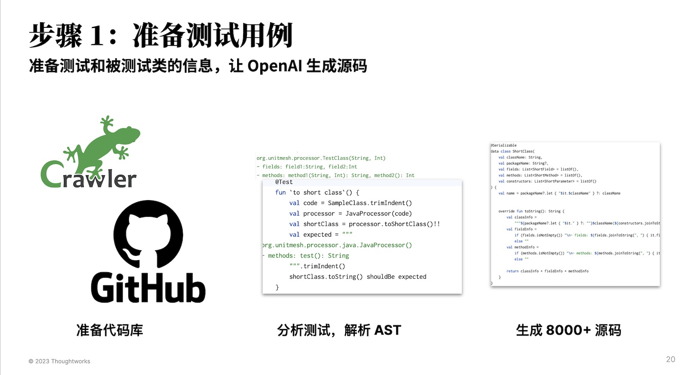

# 《AI 研发提效研究：自己动手训练 LoRA》 

Unit Minions 旨在训练 Unit Mesh 所需要的一系列 LoRA，由于过程数据复杂，便顺便编写了这个指南。

1. [《AI 研发提效研究：自己动手训练 LoRA》](#%E3%80%8Aai-%E7%A0%94%E5%8F%91%E6%8F%90%E6%95%88%E7%A0%94%E7%A9%B6%EF%BC%9A%E8%87%AA%E5%B7%B1%E5%8A%A8%E6%89%8B%E8%AE%AD%E7%BB%83-lora%E3%80%8B)
    1. [Introduction](#introduction)
        1. [Roadmap](#roadmap)
        2. [Sponsors](#sponsors)
2. [总结设计：流程标准化](#%E6%80%BB%E7%BB%93%E8%AE%BE%E8%AE%A1%EF%BC%9A%E6%B5%81%E7%A8%8B%E6%A0%87%E5%87%86%E5%8C%96)
    1. [研发效能](#%E7%A0%94%E5%8F%91%E6%95%88%E8%83%BD)
    2. [Unit Mesh](#unit-mesh)
3. [数据生成：质量驱动](#%E6%95%B0%E6%8D%AE%E7%94%9F%E6%88%90%EF%BC%9A%E8%B4%A8%E9%87%8F%E9%A9%B1%E5%8A%A8)
    1. [用户故事生成](#%E7%94%A8%E6%88%B7%E6%95%85%E4%BA%8B%E7%94%9F%E6%88%90)
        1. [步骤 1. 生成用户任务](#%E6%AD%A5%E9%AA%A4-1.-%E7%94%9F%E6%88%90%E7%94%A8%E6%88%B7%E4%BB%BB%E5%8A%A1)
        2. [步骤 2. 分解用户任务为用户故事](#%E6%AD%A5%E9%AA%A4-2.-%E5%88%86%E8%A7%A3%E7%94%A8%E6%88%B7%E4%BB%BB%E5%8A%A1%E4%B8%BA%E7%94%A8%E6%88%B7%E6%95%85%E4%BA%8B)
    2. [代码辅助生成](#%E4%BB%A3%E7%A0%81%E8%BE%85%E5%8A%A9%E7%94%9F%E6%88%90)
        1. [步骤 1. 准备数据](#%E6%AD%A5%E9%AA%A4-1.-%E5%87%86%E5%A4%87%E6%95%B0%E6%8D%AE)
        2. [步骤 2. 生成指令](#%E6%AD%A5%E9%AA%A4-2.-%E7%94%9F%E6%88%90%E6%8C%87%E4%BB%A4)
        3. [类信息格式](#%E7%B1%BB%E4%BF%A1%E6%81%AF%E6%A0%BC%E5%BC%8F)
        4. [其它：核心代码逻辑](#%E5%85%B6%E5%AE%83%EF%BC%9A%E6%A0%B8%E5%BF%83%E4%BB%A3%E7%A0%81%E9%80%BB%E8%BE%91)
    3. [测试代码生成](#%E6%B5%8B%E8%AF%95%E4%BB%A3%E7%A0%81%E7%94%9F%E6%88%90)
        1. [步骤 1. 生成测试代码](#%E6%AD%A5%E9%AA%A4-1.-%E7%94%9F%E6%88%90%E6%B5%8B%E8%AF%95%E4%BB%A3%E7%A0%81)
        2. [步骤 2. 借助 OpenAI Davinci 编写实现代码（可选）](#%E6%AD%A5%E9%AA%A4-2.-%E5%80%9F%E5%8A%A9-openai-davinci-%E7%BC%96%E5%86%99%E5%AE%9E%E7%8E%B0%E4%BB%A3%E7%A0%81%EF%BC%88%E5%8EF%BC%89)
4. [训练阶段](#%E8%AE%AD%E7%BB%83%E9%98%B6%E6%AE%B5)
    1. [基于 Meta 的 Llama 训练 LoRA](#%E5%9F%BA%E4%BA%8E-meta-%E7%9A%84-llama-%E8%AE%AD%E7%BB%83-lora)
        1. [训练 1：测试代码生成](#%E8%AE%AD%E7%BB%83-1%EF%BC%9A%E6%B5%8B%E8%AF%95%E4%BB%A3%E7%A0%81%E7%94%9F%E6%88%90)
        2. [训练 2：拆分用户故事](#%E8%AE%AD%E7%BB%83-2%EF%BC%9A%E6%8B%86%E5%88%86%E7%94%A8%E6%88%B7%E6%95%85%E4%BA%8B)
        3. [训练 3：代码辅助](#%E8%AE%AD%E7%BB%83-3%EF%BC%9A%E4%BB%A3%E7%A0%81%E8%BE%85%E5%8A%A9)
        4. [SQL 转代码](#sql-%E8%BD%AC%E4%BB%A3%E7%A0%81)
    1. [基于清华大学的 ChatGLM 训练 LoRA](#%E5%9F%BA%E4%BA%8E%E6%B8%85%E5%8D%8E%E5%A4%A7%E5%AD%A6%E7%9A%84-chatglm-%E8%AE%AD%E7%BB%83-lora)
        1. [代码生成](#%E4%BB%A3%E7%A0%81%E7%94%9F%E6%88%90)
        2. [测试生成](#%E6%B5%8B%E8%AF%95%E7%94%9F%E6%88%90)
        3. [用户故事生成](#%E7%94%A8%E6%88%B7%E6%95%85%E4%BA%8B%E7%94%9F%E6%88%90)


## Introduction

相关数据转换参见：[https://github.com/unit-mesh/minions-data-prepare](https://github.com/unit-mesh/minions-data-prepare)

LLaMA 系列在线视频：

- 《[代码辅助生成](https://www.bilibili.com/video/BV1Rh411u74H/)》
- 《[测试代码生成](https://www.bilibili.com/video/BV1jg4y1G7Xc/)》
- 《[详细需求生成](https://www.bilibili.com/video/BV1Us4y1N7rd/)》
- 《[文本转 SQL](https://www.bilibili.com/video/BV1uv4y1H7bg/)》

ChatGLM 系列在线视频：

- TODOs

### Roadmap

Roadmap：

- 训练：测试代码生成（Done）
- 训练：生成用户故事（Done）
- 训练：代码辅助生成（Done）
- 训练：SQL 转换（Doing）
- 训练：文本转代码（Doing）
- 训练：……
- 训练：生成 Unit Mesh 的代码块

### Sponsors

Thanks: [AIOS Club](https://github.com/aios-chat) for OpenAI Key, Thanks [OpenBayes](https://openbayes.com/console/signup?r=phodal_uVxU) for Cloud GPU

<a href="https://github.com/gzzengwei"></a>
<a href="https://github.com/trampboy"></a>
<a href="https://github.com/daochouwangu"></a>
<a href="https://github.com/xuzongbao"></a>
<a href="https://github.com/stevenchendan"></a>
<a href="https://github.com/coderprepares"></a>
<a href="https://github.com/go-maple"></a>
<a href="https://github.com/aios-chat"></a>

PS：训练烧钱……（调用 OpenAI 生成数据（仅限于需求细化）、云 GPU），如果你觉得帮到你，可以通过以下方式，帮助我们继续往前。

<table>
  <tr>
    <td></td>
    <td></td>
  </tr>
</table>

用支付宝的同学记得注明你的 GitHub id。

### 

# 总结设计：流程标准化

Unit Mesh 依赖于对研发效能的标准化。

## 研发效能

为了训练的结果更加准确，我们详细拆分了软件开发的步骤，以确保每一步生成的是准确，进而驱动出准确的结果。如下是我们拆分的一小部分细流程的示例：

- design_restful_api
- design_plantuml_java_datastructure
- implementation_spring_controller
- implementation_controller_test
- implementation_spring_service
- ….

我们需要拆分到每一个尽可能小的步骤，在每一个细化的步骤里，喂入数据，才会让 AI 产生最大的复读机效果。

## Unit Mesh

Todos

# 数据生成：质量驱动

我们使用非常简单的 instruct，并尽可能提供，以便于集成到工具中使用。如下：

- 拆分任务。instruction：split user story tasks，input：折分用户故事任务
- 需求细化。instruction：create Agile user story for following topic，input：功能的基本信息
- 代码生成。instruction：Implement the method xxx，input：类的基本信息
- 测试生成。instruction：Write test for follow code，input：类的基本信息
- SQL 生成。instruction：text to sql，input：问题

对应的功能介绍：

- 需求细化。AI 辅助将模糊的需求转变为的需求设计，比如 “注册” 功能，生成为：”作为一个用户 xxx，填入用户名、密码信息等等，接着由人类去检查和完善。
- 代码生成。AI 辅助将详细的需求设计翻译为目标的代码，再接着由人类去检查和完善。
- 测试生成。AI 辅助根据生成的代码生成对应的测试代码，再接着由人类去检查和完善。

从测试结果来看，随着数据量的增多，比如 20000 个代码用例比 10000 个代码用例更加的 “聪明”。

## 用户故事生成

基本思路：

1. 结合常见的领域（如在线网站），借用 OpenAI 生成用户任务（如登录、浏览列表等等）
2. 根据用户故事生成用户故事。
3. 训练 Alpaca LoRA。

如下所示：



### 步骤 1. 生成用户任务

1. 调用 OpenAI 按分类创建用户任务。prompt 如下：

```markdown
Design a User Story Mapping for ${domain} application based on your understanding. Here are the requirements: 

1. Your user story map should include only user tasks to demonstrate how users will interact with the application.
2. Our user story map should be based on your understanding of the ${domain} application and its users, and should be designed to address their needs and pain points.
3. You may use any tools or formats you choose to create your user story map, but it should be easily shareable and understandable by stakeholders.
4. Your expression should be more concise and clear.
5. Your return should be like as follows:

###
User Tasks:
1. ...
###
```

示例输出：

```
User Tasks:
1. Browse and search for animations and comics
2. View details of animations and comics
3. Create an account
4. Log in to the account
5. Add animations and comics to favorites
6. Download animations and comics
7. Share animations and comics with friends
8. Rate and review animations and comics
9. Create and upload animations and comics
10. Participate in online forums and discussions
```

### 步骤 2. 分解用户任务为用户故事

2. 调用 OpenAI 根据用户任务创建用户故事。prompt 如下：

```markdown
为下面的需求编写用户故事：${domain} 应用的 ${story_name} 功能。 要求如下：

1. 必须要考虑尽可能考虑各种异常场景，添加更多的 AC。
2. 你的返回模板如下所示：

###
用户故事：可以选择宝贝出行服务
作为 莉莉妈
我想 在滴滴打车的手机客户端里选择宝贝出行服务
以便于 我能够带宝宝打车出行的时候打到有儿童座椅的车

AC 1:  莉莉妈可以选择宝贝出行服务
假设 xxx
当 xxx
于是 xxx
###
```

示例输出：

```
用户故事：可以创建和上传动画和漫画
作为一个 Animation and Comics 应用的用户
我想要创建和上传动画和漫画
以便于我可以分享我的作品给其他用户

AC 1: 用户可以创建和上传动画和漫画
假设 用户已经登录到 Animation and Comics 应用
当 用户点击创建和上传动画和漫画按钮
于是 用户可以创建和上传动画和漫画
```

## 代码辅助生成

基本思路：



### 步骤 1. 准备数据

1. 下载 GitHub 上的项目（需要包含测试用例）
2. 遍历 `src/main` 下的 Java 文件。
3. 生成每个类的基本信息：
```
PostService(PostRepository, UserRepository, ImageService)
- fields: postRepository:PostRepository, userRepository:UserRepository, userPosts:Set<Post>, imageService:ImageService
- methods: findAll(): List<Post>, addNewPost(Post): Post, saveImageToPost(String, MultipartFile, Post): int
```

### 步骤 2. 生成指令

预期 JSON 格式：

- instruction: Implement the method ${methodName}
- input: ${classInformation}
- output: ${code}

示例：

```
{"instruction":"Implement the method action","input":"com.thoughtworks.go.config.rules.AbstractDirective(DirectiveType, DirectiveType, String, String, String)\n- fields: action:String, type:String, resource:String, configErrors:ConfigErrors, directiveType:DirectiveType\n- methods: validate(ValidationContext): void, isInvalid(String, List<String>): boolean, matchesAction(String): boolean, matchesType(Class<? extends Validatable>): boolean, matchesResource(String): boolean, errors(): ConfigErrors, addError(String, String): void, equals(Object): boolean, action(): String, type(): String, resource(): String, hashCode(): int, hasErrors(): boolean, getDirectiveType(): DirectiveType","output":"public abstract class AbstractDirective implements Directive {\n\n    @ConfigAttribute(value = \"action\", optional = false)\n    protected String action;\n\n    @ConfigAttribute(value = \"type\", optional = false)\n    protected String type;\n\n    @ConfigValue\n    private String resource;\n\n    private final ConfigErrors configErrors = new ConfigErrors();\n\n    private DirectiveType directiveType;\n\n    public AbstractDirective(DirectiveType allow) {\n        this.directiveType = allow;\n    }\n\n    public AbstractDirective(DirectiveType allow, String action, String type, String resource) {\n        this.directiveType = allow;\n        this.action = action;\n        this.type = type;\n        this.resource = resource;\n    }\n\n    @Override\n    public String action() {\n        return this.action;\n    }\n}\n"}
```

### 类信息格式

格式规范：

```
包名.类名(类的构造类型)
- fields：成员变量集合（变量名:类型）
- methods：方法抽象集合（方法名(参数类型): 输出类型）
```

结果：

```
com.thoughtworks.go.config.rules.AbstractDirective(DirectiveType, DirectiveType, String, String, String)
- fields: action:String, type:String, resource:String, configErrors:ConfigErrors, directiveType:DirectiveType
- methods: validate(ValidationContext): void, isInvalid(String, List<String>): boolean, matchesAction(String): boolean, matchesType(Class<? extends Validatable>): boolean, matchesResource(String): boolean, errors(): ConfigErrors, addError(String, String): void, equals(Object): boolean, action(): String, type(): String, resource(): String, hashCode(): int, hasErrors(): boolean, getDirectiveType(): DirectiveType
```

### 其它：核心代码逻辑

```kotlin
val javaProcessor = JavaProcessor(file.readText())
val shotClass = javaProcessor.toShortClass() ?: return@forEach

javaProcessor
   .removePackage()
   .removeAllImport()
   .removeLicenseInfoBeforeImport()

javaProcessor.splitMethods().forEach { (key, value) ->
   CodegenPrompt(
       instruction = "Implement the method $key",
       input = shotClass.toString(),
       output = value
   ).let { prompt ->
       val output = Json.encodeToString(prompt)
       File("$targetPath${key}.json").writeText(output)
   }
}
```

## 测试代码生成

基本思路



语法分析思路：

- 方式 1 - 在时间有限的情况下，基于 OpenAI 的数据来完善。但是，OpenAI 编写的测试用例不一定靠谱，所以让他生成业务代码。
- 方式 2 - 在时间充裕的情况下，可以分析 AST 来合并第一和第二步，也是比较合理的方案，毕竟 OpenAI 的 API 很贵。

### 步骤 1. 生成测试代码

1. 下载 GitHub 上的项目（需要包含测试用例）
2. 建立每个项目的 `src/main` 下的 Java 文件 map，如果同时存在对应的测试文件，则拉入的数据集中。
3. 并生成每个测试对应的类的基本信息（以减少 OpenAI Token 使用）：
```
org.unitmesh.processor.TestClass(String, Int)
- fields: field1:String, field2:Int
- methods: method1(String, Int): String, method2(): Int
```
4. 按测试用例（即 @Test 方法）拆分每个测试文件，拆成 N 个（即 test1、test2 是两个不同的数据）
```java
class TestProcessorTest {
    @Test
    void test1() {
    }
    
    @Test
    void test2() {
    }
}
```

最后，生成的数据如下：

{"classInfo": "com.thoughtworks.go.security.AESEncrypter(AESCipherProvider)\n- fields: ENCODER:Base64.Encoder, DECODER:Base64.Decoder, cipherProvider:AESCipherProvider, ivProvider:IVProvider\n- methods: createIVProviderInstance(): IVProvider, canDecrypt(String): boolean, encrypt(String): String, decrypt(String): String, createSecretKeySpec(): SecretKeySpec", "testMethod": "public class AESEncrypterTest {\n\n    private AESEncrypter aesEncrypter;\n\n    @Test\n    public void shouldGenerateEncryptedText() throws CryptoException {\n        String encrypt = aesEncrypter.encrypt(\"p@ssw0rd\");\n        assertThat(encrypt).startsWith(\"AES\");\n        assertThat(encrypt.split(\":\")).hasSize(3);\n    }\n}\n", "id": "task_0"}

### 步骤 2. 借助 OpenAI Davinci 编写实现代码（可选）

详细代码见：[test-to-code.py](code/test-to-code.py)

1. 将上面的数据转换为 JSONL，合并成 prompt。
2. 让 Davinci 完成填空题。

最后生成的 prompt 示例如下：

```markdown
You are a programmer and implementation a method with TDD. Here are the requirements:

1. According follows class information and tests code to write a method.
2. Try you best to thinking corner case.
3. You only return the code, no explain.

class information: 

### 
io.github.robwin.swagger.test.AbstractContractValidator()
- methods: findExpectedPaths(Swagger, SwaggerAssertionConfig): Map<String,Path>, getPathsIncludingBasePath(Swagger): Map<String,Path>, getPathsWithPrefix(Swagger, String): Map<String,Path>, isBlankOrSlash(String): boolean
###

test code: 

### 
/**
 * Tests AbstractContractValidator.
 */
@RunWith(Enclosed.class)
public class AbstractContractValidatorTest {

    /**
     * Tests getPathsIncludingBasePath().
     */
    public static class GetPathsIncludingBasePath {

        @Test
        public void shouldReturnPathsPrefixedIfBasePathSet() {
            // given
            Swagger swagger = buildSwaggerFrom("/swagger.json");
            // when
            Map<String, Path> paths = new DummyValidator().getPathsIncludingBasePath(swagger);
            // then
            paths.entrySet().forEach(e -> assertThat(e.getKey(), startsWith(swagger.getBasePath())));
        }
    }

    /**
     * Tests findExpectedPaths().
     */
    public static class FindExpectedPaths {
    }

    private static class DummyValidator extends AbstractContractValidator {
    }
}
###

```

# 训练阶段

## 基于 Meta 的 Llama 训练 LoRA

训练：

- 方式 1：直接使用：[alpaca-lora.ipynb](alpaca-lora.ipynb) 
- 方式 2：直接使用：[OpenBayes 容器](https://openbayes.com/console/phodal/containers/JBx5YD7HTdS) （PS：使用我的专用邀请链接，注册 OpenBayes，双方各获得 60 分钟 RTX 3090 使用时长，支持累积，永久有效：
https://openbayes.com/console/signup?r=phodal_uVxU) ）

训练时间：

- 3400+ 用户故事，约 25 分钟
- 8000+ 测试代码，约 1 小时
- 10000+ 代码辅助生成，约 1.5 小时
- 20000+ 代码辅助生成，约 3 小时
- 40000+ 代码辅助生成，约 6 小时

相关背景：

1. 基础模型：Meta 开源 LLaMA 系列模型：[llama-7b-hf](https://huggingface.co/decapoda-research/llama-7b-hf)
2. Stanford Alpaca: [https://github.com/tatsu-lab/stanford_alpaca](https://github.com/tatsu-lab/stanford_alpaca)
3. Alpaca Lora：[https://github.com/tloen/alpaca-lora](https://github.com/tloen/alpaca-lora)

由于，我们的目标不是对模型调优、生成通用的模型，而是训练特定用途的 Lora。因此，我们没有加入：Stanford Alpaca 中的数据，
故所需要时间更短，如 8000+ 测试代码只需要 1 小时，3400+ 的用户故事只需要 25 分钟。

### 训练 1：测试代码生成

训练结果（LoRA）见：[https://github.com/unit-mesh/unit-minions/releases/tag/v0.0.1](https://github.com/unit-mesh/unit-minions/releases/tag/v0.0.1)

```
print(evaluate("write test", """
public Set<String> listFilesUsingJavaIO(String dir) {
    return Stream.of(new File(dir).listFiles())
      .filter(file -> !file.isDirectory())
      .map(File::getName)
      .collect(Collectors.toSet());
}
""", 0.1, 0.75, 40, 4, 512))

## Output:

public class ListFilesUsingJavaIOTest {
    @Test
    public void shouldListFilesUsingJavaIO() {
        Set<String> files = ListFilesUsingJavaIO.listFilesUsingJavaIO(new File("dir"));
        assertThat(files, containsInAnyOrder("file1", "file2", "file3"));
    }
}
```

### 训练 2：拆分用户故事

训练结果（LoRA）见：[https://github.com/unit-mesh/unit-minions/releases/tag/v0.0.2](https://github.com/unit-mesh/unit-minions/releases/tag/v0.0.2)

**示例输出**：

```
print(evaluate("create Agile user story for following topic: ", "购买电影票", 0.1, 0.75, 40, 4, 512))

用户故事：可以购买电影票
作为一个电影票购买者
我想在购买电影票应用中购买电影票
以便于我可以购买电影票
AC 1: 电影票购买者可以在购买电影票应用中购买电影票
假设 电影票购买者已经登录购买电影票应用
当 电影票购买者点击“购买电影票”按钮
于是 电影票购买者可以在购买电影票应用中购买电影票
AC 2: 电影票购买者可以在购买电影票应用中查看购买记录
假设 电影票购买者已经登录购买电影票应用
当 电影票购买者点击“查看购买记录”按钮
于是 电影票购买者可以在购买电影票应用中查看购买记录
AC 3: 电影票购买者可以在购买电影票应用中查看购买记录
假设 电影票购买者已经登录购买电影票应用
当 电影票购买者点击“查看购买记录”按��
```

### 训练 3：代码辅助

训练结果（LoRA）见：https://github.com/unit-mesh/unit-minions/releases/tag/v0.0.3

**示例输出**：

```
print(evaluate("Implement the method rmFiles", "FileUtils:", 0.1, 0.75, 40, 4, 512))

public class FileUtils {

    private FileUtils() {
    }

    public static void rmFiles(String path) {
        File dir = new File(path);
        File[] files = dir.listFiles();
        if (files != null) {
            for (File file : files) {
                if (file.isFile()) {
                    file.delete();
                } else if (file.isDirectory()) {
                    FileUtils.rmFiles(file.getAbsolutePath());
                }
            }
        }
    }
}
```

### SQL 转代码

转换脚本：[code/text-to-sql.py](code/text-to-sql.py)

直接从：[datasets/sql/sql-train.jsonl](datasets/sql/sql-train.jsonl)

**示例输出**：

```
evaluate("text to sql", "谁是最美丽的人", 0.1, 0.75, 40, 4, 512)
evaluate("text to sql", "小明今年几岁", 0.1, 0.75, 40, 4, 512)
evaluate("text to sql", "What hand guard system is used with a gas piston commando?", 0.1, 0.75, 40, 4, 512)
```

## 基于清华大学的 ChatGLM 训练 LoRA

训练：

- 直接使用：[chatglm-tuning.ipynb](chatglm-tuning.ipynb)

### 代码生成

### 测试生成

### 用户故事生成

示例 1：

```
evaluate("Instruction: 创建用户故事\nInput: 电影网站: 查看订单详情 \nAnswer:")

Instruction: 创建用户故事
Input: 电影网站: 查看订单详情 
Answer:

用户故事:可以查看订单详情
作为一个电影网站的用户
我想查看订单详情
以便于我可以了解订单的详细信息,如订单号、订单状态、订单内容等。

AC 1: 用户可以查看订单详情
假设 用户已经登录
当 用户点击查看订单详情按钮
于是 用户可以查看订单详情,包括订单号、订单状态、订单内容等。

AC 2: 用户可以查看订单详情
假设 用户没有登录
当 用户点击查看订单详情按钮
于是 用户被要求先登录,然后才能查看订单详情,包括订单号、订单状态、订单内容等。
```

示例 2：

```
evaluate("Instruction: 创建用户故事\nInput: 团购网站:用户注册\nAnswer:")

Instruction: 创建用户故事
Input: 团购网站:用户注册
Answer:
团购网站的用户注册故事:

作为一个团购网站的用户

我想注册一个团购网站的用户账号

以便于我可以使用团购服务,如购买商品、服务等。

AC 1: 团购网站的用户注册账号
假设 用户输入了注册信息
当 用户提交注册信息
于是 用户可以成功注册一个团购网站的用户账号

AC 2: 团购网站的用户注册账号
假设 用户输入了错误的注册信息
当 用户提交注册信息
于是 用户可以被提示输入正确的注册信息,并重新提交注册信息
```
